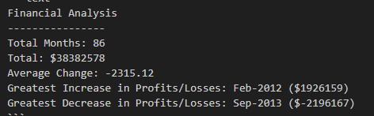

# Console-Finances
Console-Finances App

## Description

This app carries out several calculations on a set of financial data.

## Technologies Used
HTML5
JavaScript (ES6)
Git
GitHub
Visual Studio Code

## Installation

N/A

## Usage

Copy and paste financial data in the format of date and profit/loss, and it will return the total of months, total, average monthly change, the highest and the lowest change (date and amount) over the entire period. 

https://jobmoonday.github.io/Bootstrap-Portfolio/

## Screenshots of the app

 

## Credits

N/A

## License

Please refer to the LICENCE in the repo.